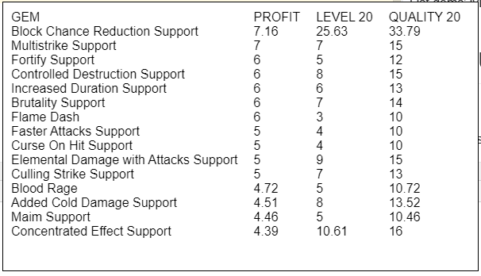
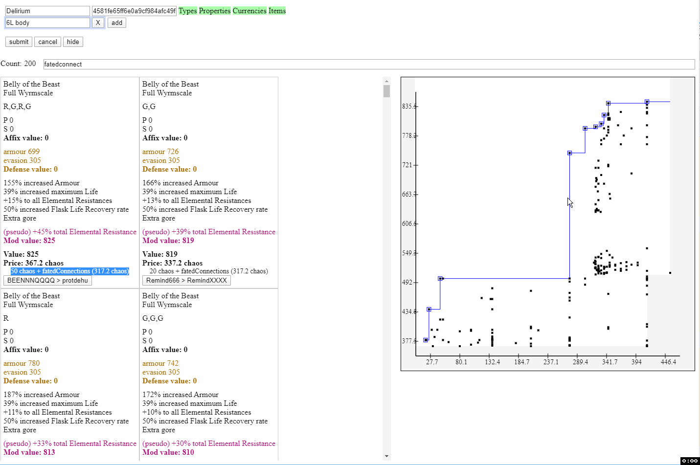
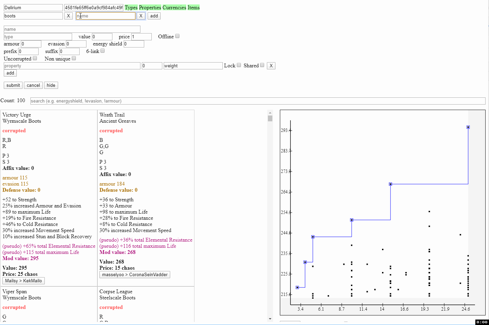
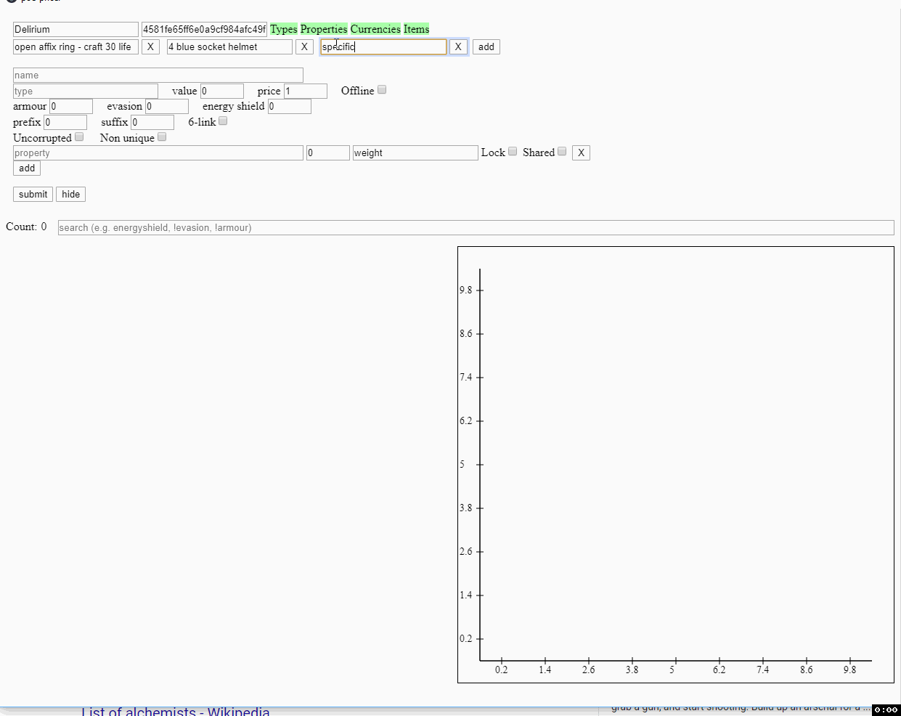
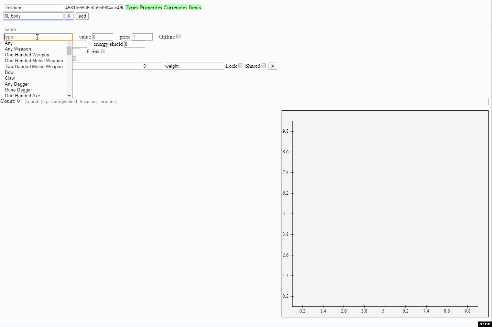

# POE Pricer

## Shortcuts

- ctrl + shift + c (or x) -> price items
- ctrl + shift + g - > display gem arbitrages
- ctrl + shift + h -> /hideout
- ctrl + shift + o -> /oos
- ctrl + shift + u -> fetch and paste login unlock verification code (gmail only)
- ctrl + shift + b -> display battery (useful for laptops using fullscreen)
- ctrl + shift + p -> display preferences (configure league)

## Pricing

Sourced from `poe.ninja` .

Includes:
- gem (per level, quality, and corrupted permutation)
- divination card
- essence
- currency
- unique jewel
- unique flask
- unique weapon (per unlinked and 6-linked)
- unique armour (per unlinked and 6-linked)
- unique accessory
- unique map
- fossil
- resonator
- fragment
- prophecy
- map
- scarab
- crafting base item (per ilvl)
- incubator
- oil
- beast
- delirium orb

## Gem Arbitrage

List gems' lvl 20 price, q 20 price, and potential profit.

## Arevtur (trade)

Find the most value / price item upgrades, sourced directly from the official trade site `pathofexile.com/trade` .

#### Starting the app

When you run POE Pricer, a `$` icon will appear in your system tray (typically at the bottom right of your screen).
Right click the icon to open the context menu and select `Arevtur` to open the app.

#### Setting up the session ID

In your browser, navigate to `pathofexile.com` and login. 
Open the developer console (`f12`) and select the `Application` panel in the top strip.
Expand the `Cookies` tree under the `Storage` label in the left strip, and select the `pathofexile.com` cookie.
In the main view, copy the value associated with the `POESESSID` key. This should be a 32 alphanumeric ID.
In the `arevtur` app, paste the value in the `Session ID` input at the top.

#### What is the purpose of session ID and is it safe to copy

The session ID allows GGG to identify users. 
Without it, GGG would not know who is using their trade site, 
and if someone were to use their trade site irresponsibly, they would have to rely on crude alternatives (i.e. IP address) to stop that user.
Hence, GGG puts strict limits on what you are allowed to do without a session ID; including what trade queries you're allowed to submit and how often.

Because `arevtur` is open source, a user can verify that the session ID is only stored locally.
In fact, no user information, not even anonymous usage statistics, are sent remotely.
I.e., other than yourself and GGG, no one will have access to your session ID.
This is very important, as sharing your session ID with someone might allow them to impersonate you to a certain extent.

#### Why is it so slow

tldr; GGG's trade API returns 10 items per request, and limits requests to 1.3 per second per user. So retrieving 100 items will take at least 7.7 seconds.

The initial request to the trade API returns with 100 item IDs.
At most 10 of these items can fetched per subsequent request, meaning a total of 11 requests are made per query.
Factoring in that many searches actually perform multiple queries, each time you press the 'submit' button, 11 to 33 requests are typically made.

In addition, GGG recently updated their API rate-limit restrictions.
It had previously been possible to make most of those requests in parallel.
But with the new restrictions, we can make at most 1.3 requests per second.
To be on the safe side and avoid timeouts, `arevtur` limits its requests to 1 per second; this is why even a simple query will take 11 seconds.

Luckily, the app will display partial results while the complete query is still in progress.
But for expensive items with complicated queries, waiting for the complete response before purchasing is ideal, as later items may be better or cheaper than earlier items. 

### Visual guide to the features

### Simple search

### Interactive graph

### Locking weights amongst properties

### Sharing properties amongst queries

### Search for a specific item

### Searching for 6-link, including the potential of the Fated Connections prophecy

### Searching for affixes

### Searching for Defenses

### Filtering results

Features:
- Interactive graph
    
    Visualize the value versus price tradeoff. Maybe you'd prefer an item 5% less powerful but at 1/10th the price. Double click to auto-focus, left drag to pan, right drag to zoom.
    
- Weight values for armour, es, and evasion

    The other trade sights allow filtering for min and max armour, es, and evasion. This allows weighting them. E.g. perhaps you value 1000 evasion, 4.5% inc life, 40 flat life, and 80 resists equally.   

- Multiple persistent queries with shared weights

    Queries are automatically saved, and weights can be shared between them. E.g. save a query for boots with min 30% speed, flat life weight 2, and resists weight 1. Then create another query for gloves, and share the life and resists weights. Update either query's weights, and the other query will also be updated. Additionally, you can merge multiple queries, e.g. if you want either a high life glove or a specific unique.

- 6 link search

    Includes not only 6-linked items, but also uncorrupted, unlinked items with the price of the Fated Connections prophecy factored in.

- Conditional affix

    Not only can you add value weights to open suffixes and prefixes, you can also condition them on not having certain mods already present. E.g. if you consider a crafted flat life on a ring as 60 value, the search will include items that are uncorrupted, uncrafted, have an open prefix, and don't already have a flat life explicit. Can include multiple conditional affixes; e.g. in case an item has a flat life explicit and so you'd instead craft flat mana.

- Smart search

    E.g. search '!unset, !moonstone' to hide all unset and moonstone rings. 
